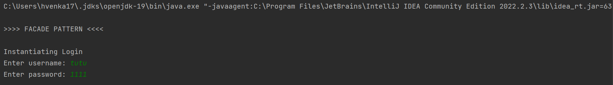
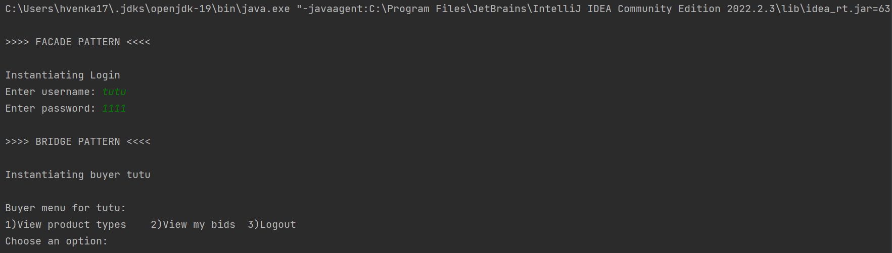
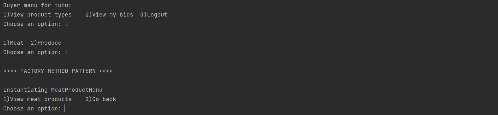
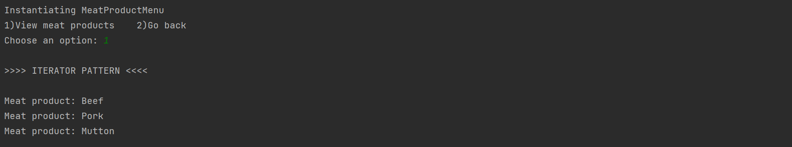
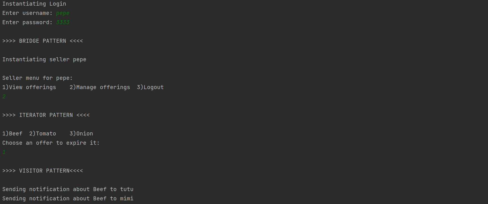

# Product Trading and Bidding System (PTBS)

Five design patterns are implemented within the PTBS system:
1. Facade pattern
2. Bridge pattern
3. Factory method pattern
4. Iterator pattern
5. Visitor pattern

## Example outputs of each design pattern:
## 1. Facade pattern

## 2. Bridge pattern

## 3. Factory method pattern

## 4. Iterator pattern

## 5. Visitor pattern

## Execution steps
1. Open the folder as a project in IntelliJ IDEA
2. Configure the Java SDK with the local java version of the machine
   (Ensure JDK11++)
3. Run the `Main` class in `src/Main.java`*(Shift + F10)*